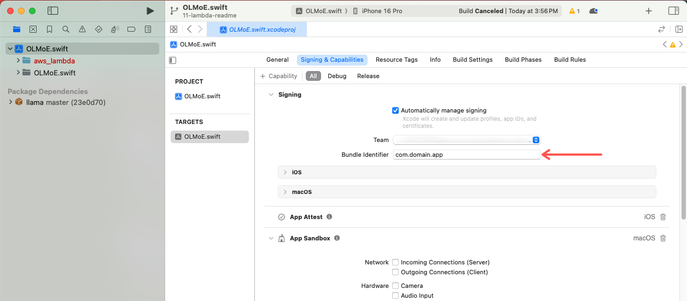
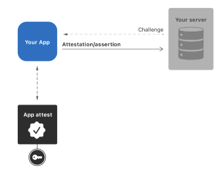

# AWS Lambda to Enable Logging to S3

An AWS Lambda function to facilitate logging and storing chat traces in an S3 bucket, with support for Apple App Attestation to ensure secure and legitimate access.

Note: This Lambda function is specifically designed for sharing chats as URLs and is optional.
It is not required for the core functionality of the app, so setting it up is only necessary if you intend to use the chat-sharing feature.

## Table of Contents

- [Requirements](#requirements)
- [Setup](#setup)
  - [AWS CLI and SAM CLI](#aws-cli-and-sam-cli)
  - [Environment Variables](#environment-variables)
- [Build](#build)
- [Testing and Local Invocation](#testing-and-local-invocation)
- [Deploy](#deploy)

---

## Requirements

To work with this project, ensure the following prerequisites are met:

- **Python 3.11**
- **AWS Account** with configured credentials
- **AWS CLI**: Command Line Interface for AWS
- **AWS SAM CLI**: For building and deploying serverless applications
- **Docker**: For local invocation and builds
- **S3 Bucket**: For storing chat traces

---

## Setup

### AWS CLI and SAM CLI

1. **Install AWS CLI**
   Follow the instructions [here](https://aws.amazon.com/cli/).

2. **Configure AWS CLI**
   Log in and configure the default profile for AWS CLI.

   ```sh
   aws configure
   ```

3. **Install Docker or OrbStack**
   Ensure Docker is installed and running on your system.

4. **Install SAM CLI**
   Use the following command:

   ```sh
   pip install --upgrade aws-sam-cli

   ```

### Environment variables

1. Create an .env.json file:

   ```sh
   cp .env.example.json .env.json

   ```

2. Populate the `.env.json` file with the required environment variables:

   |Variable|Data Type|Default|Description|
   |---|---|---|---|
   |`BucketName`|String|None|The name of the S3 bucket where the shared conversation traces will be stored.|
   |`S3LogPrefix`|String|"logs"|The prefix for log files in the S3 bucket.|
   |`S3SharePrefix`|String|"share"|The prefix for shared files in the S3 bucket.|
   |`CertificateAsBytes`|String|None|Apple App Attestation Root CA, added to `.env.json` as a single line of text without comments or newlines.|
   |`HmacShaKey`|String|None|The HMAC SHA key for signing Apple Attest challenges.|
   |`Env`|String|"prod"|The environment (e.g., `prod` or `dev`).|
   |`MaxRequestSizeBytes`|Integer|50KB|The maximum allowed request size in bytes.|
   |`AppId`|String|None|The application ID in the format `{DEVELOPMENT_TEAM_ID}.{PRODUCT_BUNDLE_IDENTIFIER}`. To obtain your team Id refer to [Locate your team ID](https://developer.apple.com/help/account/manage-your-team/locate-your-team-id/). Your Product Bundle Identifier should be in this format: com.domain.app_name (See image below). Your `AppId` environment variable value is the concatenation of these two ids joined by a period. For example: "ABC1234567.com.domain.app_name" |

   Your `PRODUCT_BUNDLE_IDENTIFIER` can be found here:

   

## Build

1. Build the Lambda function using SAM CLI:

   ```sh
   sam build
   ```

   Alternatively, if you are using vscode press `Cmd + Shift + B` to build.

2. Install Python dependencies:

   ```sh
   pip install -r src/requirements.txt -t .aws-sam/build
   ```

   **Note**: Install dependencies only once unless `src/requirements.txt` changes.

## Testing and Local Invocation

This Lambda implements [Apple's App Attestation](https://developer.apple.com/documentation/devicecheck/establishing-your-app-s-integrity) to ensure requests originate from verified app instances.

[](https://developer.apple.com/documentation/devicecheck/establishing-your-app-s-integrity)

### Testing Execution Paths

There are two execution paths for the lambda that can be tested separately.
Bear in mind, attestation is disabled on local invoke since a valid keyId and attestation object need to be retrieved from a a physical device running a legitimate instance of the app.

1. Get the Attest Challenge

   - Using VS Code or Cursor:

      `Cmd + Shift + P` -> `Run Task` -> `Test GetChallenge`

   - Or manually:

      ```sh
      sam local invoke OlmoeAttestS3LoggingFunction -e tests/get_challenge.json --parameter-overrides $(cat .env.test.json | jq -r 'to_entries | map("\(.key)=\(.value|tostring)") | .[]')
      ```

2. Share conversation trace

   - Using VS Code or Cursor:

      `Cmd + Shift + P` -> `Run Task` -> `Test ShareTrace`

   - Or manually:

      ```sh
      sam local invoke OlmoeAttestS3LoggingFunction -e tests/prod_attest.json --parameter-overrides $(cat .env.test.json | jq -r 'to_entries | map("\(.key)=\(.value|tostring)") | .[]')
      ```

## Deploy

1. Ensure the Lambda is built before deploying.

2. First-time deployment (no `samconfig.toml`):

   ```sh
   sam deploy --guided --parameter-overrides $(cat .env.json | jq -r 'to_entries | map("\(.key)=\(.value|tostring)") | .[]')
   ```

3. Subsequent deployments:

   - VS Code or Cursor:

      `Cmd + Shift + P` -> `Run Task` -> `Deploy Lambda`

   - Or manually:

      ```sh
      sam deploy --parameter-overrides $(cat .env.json | jq -r 'to_entries | map("\(.key)=\(.value|tostring)") | .[]')
      ```
