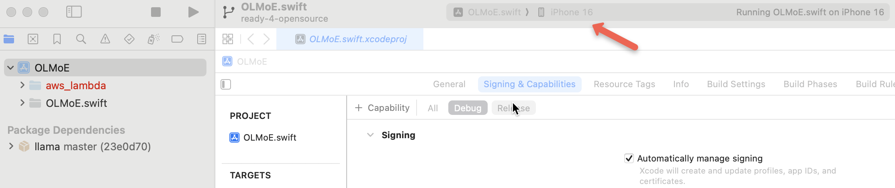
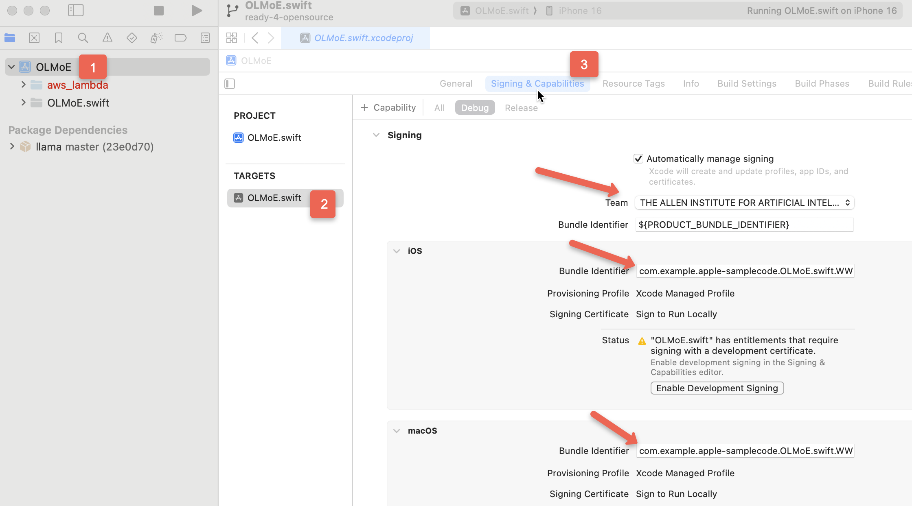
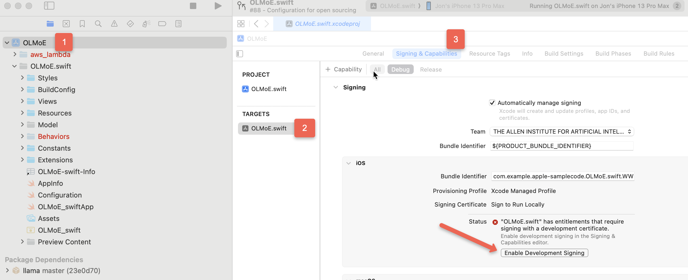
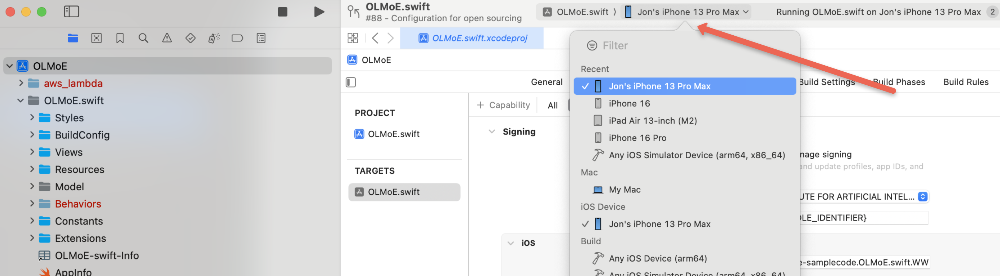
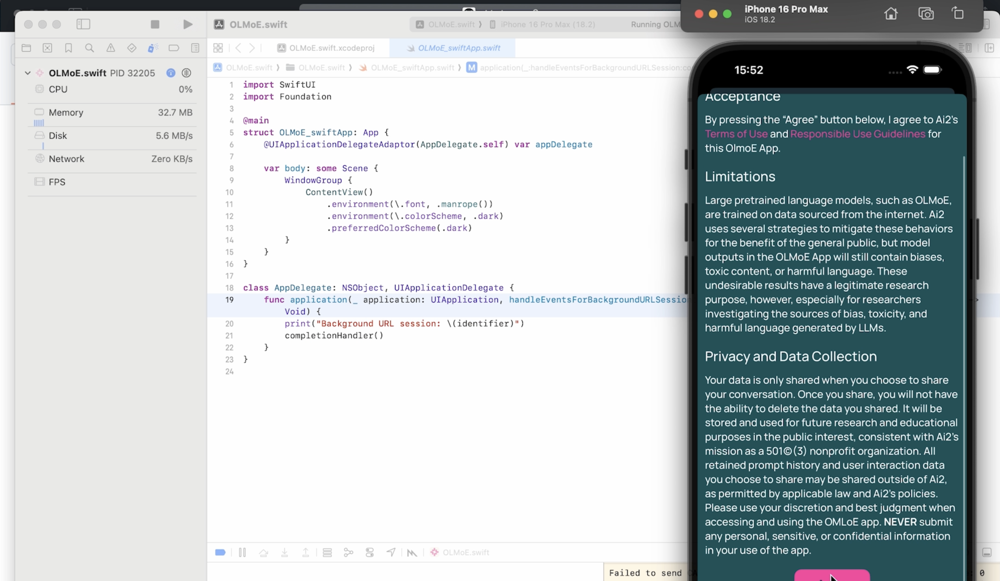

# OLMoE Swift

## Requirements

- Xcode 15.4+
- iOS 17+

## Building the iOS app to run on a simulator

1) Open the project in Xcode.

1) Ensure the target device is set to an appropriate device (ie iPhone 15 Pro or higher)

    

1) Run the project

## Building the iOS App with custom settings

Using environment variables in `BuildConfig/build.xcconfig`, you can override the default settings in the project.
Default values are provided in `BuildConfig/project-defaults.xcconfig`.

1) Log in to [Apple Developer](https://developer.apple.com).
    To find the Team ID, see: [Locate your team ID](https://developer.apple.com/help/account/manage-your-team/locate-your-team-id/).

1) Rename `BuildConfig/build.example.xcconfig` to `build.xcconfig`.

1) Populate the `build.xcconfig` file with your API key and endpoint.

    - The `API_URL` should be the endpoint to access the lambda function.
    In our example, we used an AWS API Gateway endpoint that forwards requests to the lambda function.
    Without this value, the app will not be able to connect to the lambda function and the "sharing" feature will not work.
    The rest of the app will function fine though.
    See [Enabling the Sharing Feature](#enabling-the-sharing-feature) for more information.

    - The `API_KEY` is the key to access the API Gateway endpoint.
    Without this value, the app will not be able to connect to the lambda function and the "sharing" feature will not work.
    The rest of the app will function fine though.
    See [Enabling the Sharing Feature](#enabling-the-sharing-feature) for more information.

    - The `DEVELOPMENT_TEAM_ID` is your team ID you located in step 1.
    Building to a physical device requires a development team ID.

    - The `BUNDLE_VERSION` is the number used to identify the [current project version](https://developer.apple.com/documentation/xcode/build-settings-reference#Current-Project-Version) and the iteration of the [bundle version](https://developer.apple.com/documentation/bundleresources/information-property-list/cfbundleversion).

    - The `BUNDLE_VERSION_PUBLIC` is the [public version](https://developer.apple.com/documentation/bundleresources/information-property-list/cfbundleshortversionstring) number of the application and the [marketing version](https://developer.apple.com/documentation/xcode/build-settings-reference#Marketing-Version).

    - The `PRODUCT_BUNDLE_IDENTIFIER` is the bundle identifier for the app.
    This can be assigned your unique identifier or the default value (see [`project-defaults.xcconfig`](BuildConfig/project-defaults.xcconfig)).

    ```swift
    API_KEY=your_api_key_here
    API_URL=api_url
    BUNDLE_VERSION=10
    BUNDLE_VERSION_PUBLIC=1.1.1
    DEVELOPMENT_TEAM_ID=your_team_id
    PRODUCT_BUNDLE_IDENTIFIER=com.example.apple-samplecode.OLMoE.swift.${DEVELOPMENT_TEAM_ID}
    ```

1) Open the project in Xcode.

1) Ensure the target device is set to an appropriate device (ie iPhone 15 Pro or higher)

    

1) Run the project

## Enabling the Sharing Feature

Requires an _AWS Lambda function_

1) Follow and deploy the lambda function as described in the [lambda README](../aws-lambda/README.md).

## Troubleshooting

### Ensure the correct configuration is being used

1) Select the project in the Project Navigator.

1) In configurations ensure "Debug and Release" is set to use `build.xcconfig`

    

### Ensure the correct team is selected

1) In "Signing & Capabilities" ensure your correct team and bundle identifier match the ones in `build.xcconfig`

    

### Running on a physical device

1) Ensure the device is connected to your mac via USB.

1) In the Signing & Capabilities section, click on "Enable Development Signing"

    

1) Select your device in the device dropdown menu.

    

1) Run the project by hiting **Run** ▶️ or press `Cmd + R`.

    
